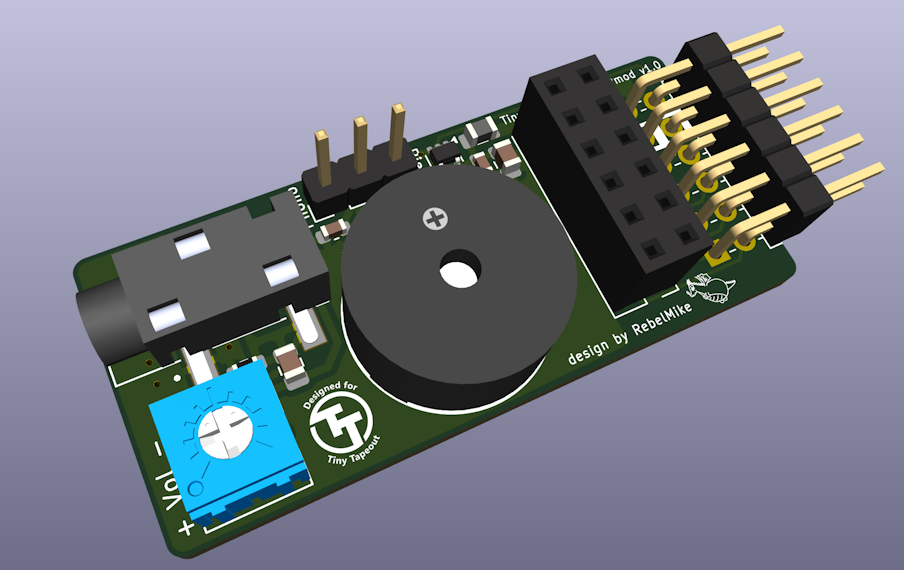
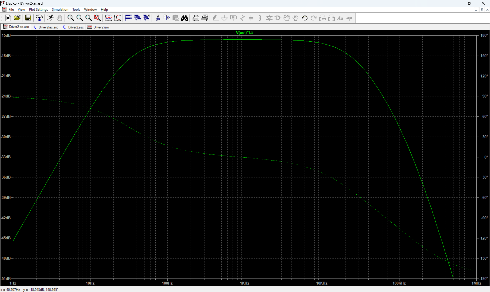

# Tiny Tapeout Audio Pmod

This Pmod is designed to play mono PWM audio from out[7] or bidir[7], while allowing a second Pmod to be plugged in, passing through bidir[0-6] or out[0-6].  

The design has a low pass filter, to allow a large range of audio to be played the cutoff frequency is quite high.  It is therefore recommended that the PWM frequency is at least 200kHz to get good results.

If the piezo is selected with the jumper, it is driven after the low pass filter with no further filtering.

If the headphone jack is selected, AC coupling is applied to give a balanced signal.

The volume trim pot should be turned down to around 30-35 ohms to give nominal line level when the output is connected to a high impedance line in.  If using headphones with a low impedance it should be turned up towards the high end of the range (180-200 ohms).

IO 7 on the second Pmod is pulled high, which allows compatibility with the [QSPI Pmod](https://github.com/mole99/qspi-pmod).

The Pmod was designed in KiCad 8, here is the [schematic](tt-audio-pmod.pdf).

## Simulation

The frequency response of the design was simulated in ltspice:

The ltspice simulations are in the [sim](sim/) directory.

## Testing

The first version of the Pmod is being manufactured and will be tested soon.

## Credits

Designed for Tiny Tapeout by RebelMike with the help of the excellent Tiny Tapeout Discord community.

   Copyright 2024 Mike Bell

   Licensed under the Apache License, Version 2.0 (the "License");
   you may not use this file except in compliance with the License.
   You may obtain a copy of the License at

   http://www.apache.org/licenses/LICENSE-2.0

   Unless required by applicable law or agreed to in writing, software
   distributed under the License is distributed on an "AS IS" BASIS,
   WITHOUT WARRANTIES OR CONDITIONS OF ANY KIND, either express or implied.
   See the License for the specific language governing permissions and
   limitations under the License.

Image on the reverse is by [ArtRose on Pixabay](https://pixabay.com/vectors/musical-notes-music-smile-merry-6159007/).  Used under the [Pixabay Content License](https://pixabay.com/service/license-summary/)
